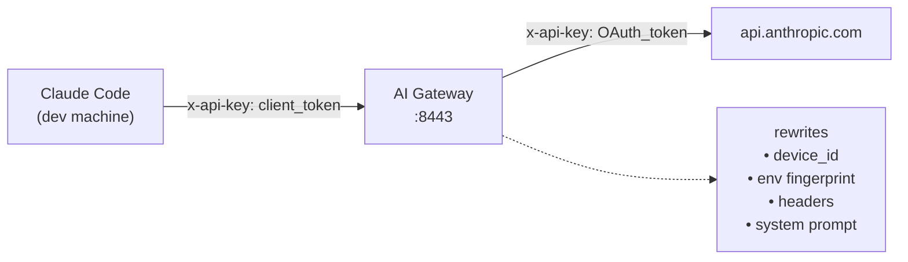

# AI Gateway

> **AI API 身份网关** — 反向代理，用于归一化多台 Claude Code 客户端的设备指纹与遥测信息。
>
> [📖 查看中文文档 →](README_zh-CN.md)
>
> ---
>
> *Read this in [English](README_en.md).*

 

Route multiple Claude Code client machines through a single gateway so the Anthropic API sees one consistent device identity. Share one OAuth session across your team while each developer keeps their own client token.

**[English](README_en.md)** | **[中文](README_zh-CN.md)**
