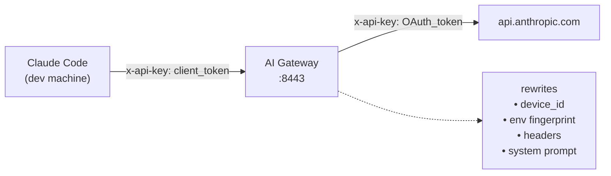

[**中文**](README_zh-CN.md) | **English**

# AI Gateway

**AI API identity gateway** — reverse proxy that normalizes device fingerprints and telemetry for Claude Code.

Route multiple Claude Code client machines through a single gateway so the Anthropic API sees one consistent device identity. Share one OAuth session across your team while each developer keeps their own client token.

## Architecture



## Features

- **Device identity normalization** — all clients appear as one device to the upstream API
- **OAuth token management** — automatic refresh with 5-minute preemptive scheduler
- **Request body rewriting** — normalizes device ID, environment fingerprint, process metrics, system prompt blocks, billing headers
- **Header sanitization** — strips hop-by-hop headers, billing headers, rewrites user-agent
- **Session-level version hashing** — deterministic 3-char hash per session from user message content
- **Client authentication** — per-developer tokens with named entries
- **Audit logging** — optional request/response logging
- **Health & verification endpoints** — inspect gateway state and preview body rewrites
- **Dual build system** — Maven and Gradle (Kotlin DSL)

## Prerequisites

- JDK 25+
- One machine that has already authenticated Claude Code (to extract OAuth credentials)
- `openssl` (for device ID generation)
- `python3` (for setup scripts)

## Quick Start (Development)

```bash
# 1. Build the gateway
mvn package -DskipTests
# or
./gradlew bootJar

# 2. Run quick setup (generates config from local Claude Code installation)
bash scripts/quick-setup.sh my-client

# 3. The gateway starts on port 8443
#    A client launcher is created at clients/cc-my-client

# 4. On any client machine, run the launcher
./clients/cc-my-client

#    Or manually set environment variables:
#    export ANTHROPIC_BASE_URL=https://gateway-host:8443
#    export ANTHROPIC_API_KEY=<client_token>
#    claude
```

## Production Deployment

```bash
bash scripts/admin-setup.sh
```

Interactive script that guides you through:
- Extracting OAuth credentials
- Choosing deployment mode (HTTPS with self-signed certs or HTTP behind Tailscale/VPN)
- Auto-detecting LAN IP
- Generating TLS certificates
- Writing production `application.yml`
- Starting via Docker or direct Java execution

### Docker

```bash
docker compose up -d --build
```

Mount your `application.yml`:

```yaml
# docker-compose.yml
services:
  gateway:
    build: .
    ports:
      - "8443:8443"
    volumes:
      - ./application.yml:/app/application.yml
```

## Configuration

All configuration is under the `gateway.*` prefix in `application.yml`.

```yaml
gateway:
  upstream: https://api.anthropic.com

  identity:
    device_id: "<64-char-hex>"      # generate with: openssl rand -hex 32
    email: "team@example.com"

  auth:
    tokens:
      - name: alice
        token: "<hex-token>"
      - name: bob
        token: "<hex-token>"

  oauth:
    refresh_token: "<from-claude-oauth>"

  env:
    platform: darwin
    arch: arm64
    version: 2.1.81
    # 40+ environment dimensions (see application.yml)

  prompt_env:
    platform: darwin
    shell: zsh
    os_version: Darwin 24.4.0
    working_dir: /Users/jack/projects

  process:
    constrained_memory: 17179869184    # 16 GB
    rss_range: [300000000, 600000000]
    heap_total_range: [400000000, 700000000]
    heap_used_range: [200000000, 500000000]

  logging:
    audit: false                        # log request/response pairs
```

### Generating a Client Token

```bash
bash scripts/add-client.sh <name> [token] [gateway_addr] [protocol]
```

Generates a launcher script at `clients/cc-<name>` with subcommands:
- `install` — add to PATH as `ccg`
- `hijack` — alias `claude` to route through the gateway
- `release` — remove the hijack
- `native` — bypass gateway, use direct API key
- `status` — show current gateway routing state

## Build

### Maven

```bash
mvn package -DskipTests
# Output: target/gateway.jar
```

### Gradle

```bash
./gradlew bootJar
# Output: build/libs/ai-gateway-0.2.0.jar
```

## API Endpoints

| Endpoint | Method | Description |
|----------|--------|-------------|
| `/_health` | GET | Gateway status — OAuth validity, device ID, client list |
| `/_verify` | GET | Body rewrite preview — before/after comparison |
| `/v1/messages` | POST | Proxied to Anthropic API |
| `/v1/messages/batch` | POST | Proxied to Anthropic API |

### Health Response

```json
{
  "status": "ok",
  "oauth": "valid",
  "canonical_device": "a1b2c3d4...",
  "upstream": "https://api.anthropic.com",
  "clients": ["alice", "bob"]
}
```

## Scripts

| Script | Purpose |
|--------|---------|
| `scripts/generate-identity.sh` | Generate a random 64-char device ID |
| `scripts/extract-token.sh` | Extract OAuth tokens from local Claude Code installation |
| `scripts/add-client.sh` | Create a named client token and launcher script |
| `scripts/quick-setup.sh` | One-command development setup |
| `scripts/admin-setup.sh` | Production deployment with TLS and Docker support |

## Project Structure

```
.
├── build.gradle.kts           # Gradle build (Kotlin DSL)
├── pom.xml                    # Maven build
├── settings.gradle.kts        # Gradle settings
├── Dockerfile                 # Docker image (Maven-based)
├── scripts/
│   ├── generate-identity.sh
│   ├── extract-token.sh
│   ├── add-client.sh
│   ├── quick-setup.sh
│   └── admin-setup.sh
├── src/main/
│   ├── java/ai/gateway/
│   │   ├── GatewayApplication.java       # Spring Boot entry
│   │   ├── config/
│   │   │   ├── AppConfig.java            # Bean definitions
│   │   │   └── GatewayProperties.java    # Configuration model
│   │   ├── auth/
│   │   │   └── Authenticator.java        # Client token auth
│   │   ├── oauth/
│   │   │   ├── TokenManager.java         # OAuth token lifecycle
│   │   │   └── TokenRefreshScheduler.java # Periodic refresh
│   │   ├── proxy/
│   │   │   ├── ProxyFilter.java          # Core proxy logic
│   │   │   ├── ProxyInit.java            # Boot-time wiring
│   │   │   ├── HeaderRewriter.java       # Header normalization
│   │   │   └── AdminController.java      # Health & verify APIs
│   │   └── rewriter/
│   │       ├── BodyRewriter.java         # Body normalization
│   │       └── ClaudeCodeHash.java       # Session hash computation
│   └── kotlin/ai/gateway/
│       └── DeviceFingerprint.kt          # Kotlin utility
│   └── resources/
│       └── application.yml               # Default config
└── docs/
    └── 启动前置准备.md                     # Chinese setup guide
```
