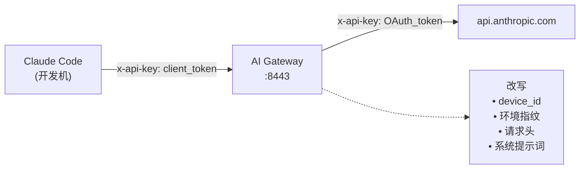

**中文** | [**English**](README_en.md)

# AI Gateway

**AI API 身份网关** — 反向代理，用于归一化多台 Claude Code 客户端的设备指纹与遥测信息。

将多台 Claude Code 客户端通过统一网关转发，使 Anthropic API 看到的始终是同一个设备身份。团队共享一份 OAuth 会话，每位开发者独立持有自己的客户端令牌。

## 架构



## 功能

- **设备身份归一化** — 所有客户端对上游 API 呈现为同一设备
- **OAuth 令牌管理** — 自动刷新，5 分钟预刷新调度
- **请求体改写** — 归一化设备 ID、环境指纹、进程指标、系统提示词块、计费头
- **请求头清洗** — 移除逐跳头、计费头，改写 user-agent
- **会话级版本哈希** — 根据用户消息内容生成确定性 3 字符哈希
- **客户端认证** — 每位开发者独立令牌，支持命名条目
- **审计日志** — 可选的请求/响应日志记录
- **健康检查与验证端点** — 查看网关状态，预览请求体改写效果
- **双构建系统** — Maven 和 Gradle（Kotlin DSL）

## 前置条件

- JDK 25+
- 一台已完成 Claude Code OAuth 登录的机器（用于提取 OAuth 凭据）
- `openssl`（生成设备 ID）
- `python3`（设置脚本依赖）

## 快速开始（开发环境）

```bash
# 1. 构建网关
mvn package -DskipTests
# 或
./gradlew bootJar

# 2. 运行快速设置（从本地 Claude Code 安装中提取配置）
bash scripts/quick-setup.sh my-client

# 3. 网关启动在 8443 端口
#    客户端启动脚本创建在 clients/cc-my-client

# 4. 在任何客户端机器上运行启动脚本
./clients/cc-my-client

#    或手动设置环境变量：
#    export ANTHROPIC_BASE_URL=https://网关地址:8443
#    export ANTHROPIC_API_KEY=<客户端令牌>
#    claude
```

## 生产部署

```bash
bash scripts/admin-setup.sh
```

交互式脚本，引导完成：
- 提取 OAuth 凭据
- 选择部署模式（HTTPS + 自签名证书，或 Tailscale/VPN 内网 HTTP）
- 自动检测局域网 IP
- 生成 TLS 证书
- 写入生产 `application.yml`
- 通过 Docker 或直接 Java 启动

### Docker

```bash
docker compose up -d --build
```

挂载你的 `application.yml`：

```yaml
# docker-compose.yml
services:
  gateway:
    build: .
    ports:
      - "8443:8443"
    volumes:
      - ./application.yml:/app/application.yml
```

## 配置说明

所有配置位于 `application.yml` 的 `gateway.*` 前缀下。

```yaml
gateway:
  upstream: https://api.anthropic.com

  identity:
    device_id: "<64位十六进制字符串>"   # 生成: openssl rand -hex 32
    email: "team@example.com"

  auth:
    tokens:
      - name: alice
        token: "<十六进制令牌>"
      - name: bob
        token: "<十六进制令牌>"

  oauth:
    refresh_token: "<来自 Claude OAuth>"

  env:
    platform: darwin
    arch: arm64
    version: 2.1.81
    # 40+ 个环境维度（详见 application.yml）

  prompt_env:
    platform: darwin
    shell: zsh
    os_version: Darwin 24.4.0
    working_dir: /Users/jack/projects

  process:
    constrained_memory: 17179869184    # 16 GB
    rss_range: [300000000, 600000000]
    heap_total_range: [400000000, 700000000]
    heap_used_range: [200000000, 500000000]

  logging:
    audit: false                        # 是否记录请求/响应日志
```

### 生成客户端令牌

```bash
bash scripts/add-client.sh <名称> [令牌] [网关地址] [协议]
```

在 `clients/cc-<名称>` 生成启动脚本，支持子命令：
- `install` — 加入 PATH，命令名为 `ccg`
- `hijack` — 将 `claude` 别名指向网关
- `release` — 解除别名
- `native` — 绕过网关，直接使用 API Key
- `status` — 查看当前网关路由状态

## 构建

### Maven

```bash
mvn package -DskipTests
# 输出: target/gateway.jar
```

### Gradle

```bash
./gradlew bootJar
# 输出: build/libs/ai-gateway-0.2.0.jar
```

## API 端点

| 端点 | 方法 | 说明 |
|------|------|------|
| `/_health` | GET | 网关状态 — OAuth 有效性、设备 ID、客户端列表 |
| `/_verify` | GET | 请求体改写预览 — 改写前后对比 |
| `/v1/messages` | POST | 转发至 Anthropic API |
| `/v1/messages/batch` | POST | 转发至 Anthropic API |

### 健康检查响应

```json
{
  "status": "ok",
  "oauth": "valid",
  "canonical_device": "a1b2c3d4...",
  "upstream": "https://api.anthropic.com",
  "clients": ["alice", "bob"]
}
```

## 脚本

| 脚本 | 用途 |
|------|------|
| `scripts/generate-identity.sh` | 生成随机 64 字符设备 ID |
| `scripts/extract-token.sh` | 从本地 Claude Code 安装提取 OAuth 令牌 |
| `scripts/add-client.sh` | 创建命名客户端令牌和启动脚本 |
| `scripts/quick-setup.sh` | 一键开发环境设置 |
| `scripts/admin-setup.sh` | 生产部署，支持 TLS 和 Docker |

## 项目结构

```
.
├── build.gradle.kts           # Gradle 构建（Kotlin DSL）
├── pom.xml                    # Maven 构建
├── settings.gradle.kts        # Gradle 设置
├── Dockerfile                 # Docker 镜像（基于 Maven）
├── scripts/
│   ├── generate-identity.sh
│   ├── extract-token.sh
│   ├── add-client.sh
│   ├── quick-setup.sh
│   └── admin-setup.sh
├── src/main/
│   ├── java/ai/gateway/
│   │   ├── GatewayApplication.java       # Spring Boot 入口
│   │   ├── config/
│   │   │   ├── AppConfig.java            # Bean 定义
│   │   │   └── GatewayProperties.java    # 配置模型
│   │   ├── auth/
│   │   │   └── Authenticator.java        # 客户端令牌认证
│   │   ├── oauth/
│   │   │   ├── TokenManager.java         # OAuth 令牌生命周期
│   │   │   └── TokenRefreshScheduler.java # 定时刷新
│   │   ├── proxy/
│   │   │   ├── ProxyFilter.java          # 核心代理逻辑
│   │   │   ├── ProxyInit.java            # 启动时初始化
│   │   │   ├── HeaderRewriter.java       # 请求头归一化
│   │   │   └── AdminController.java      # 健康检查与验证 API
│   │   └── rewriter/
│   │       ├── BodyRewriter.java         # 请求体归一化
│   │       └── ClaudeCodeHash.java       # 会话哈希计算
│   └── kotlin/ai/gateway/
│       └── DeviceFingerprint.kt          # Kotlin 工具类
│   └── resources/
│       └── application.yml               # 默认配置
└── docs/
    └── 启动前置准备.md                     # 详细设置指南
```
